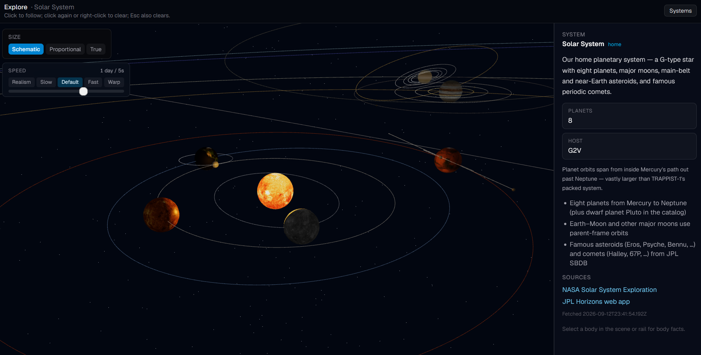
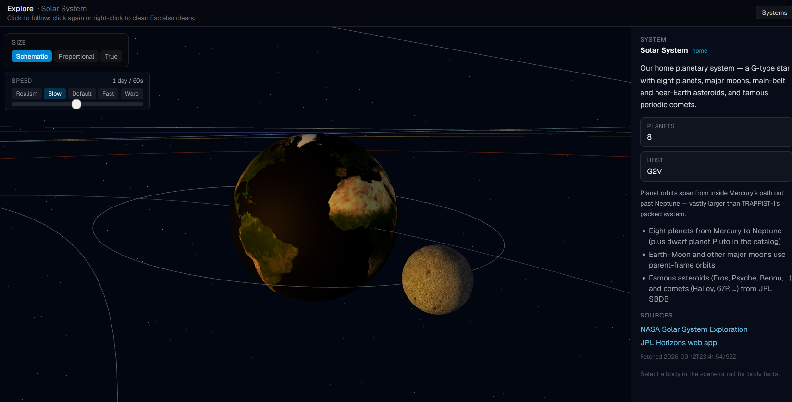
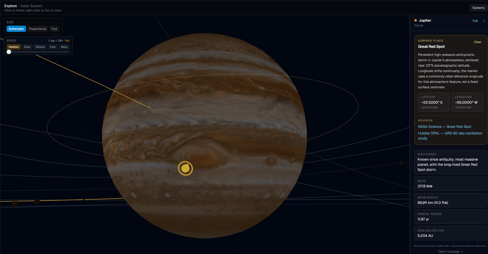
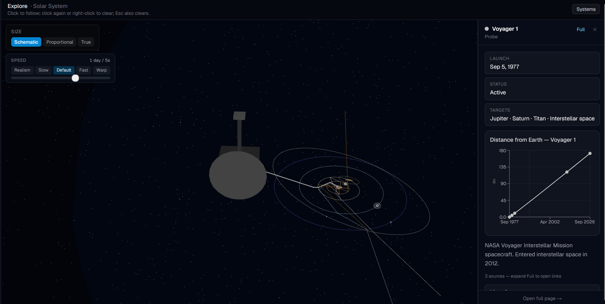
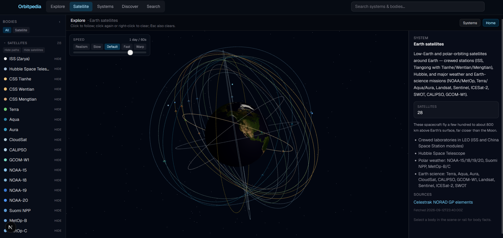
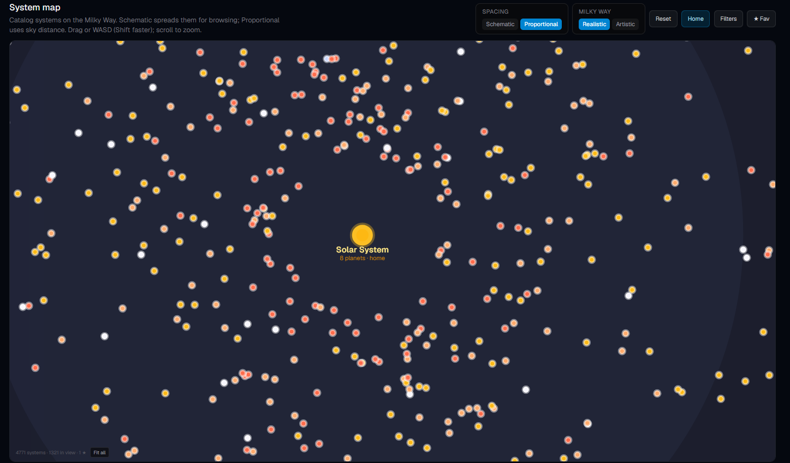
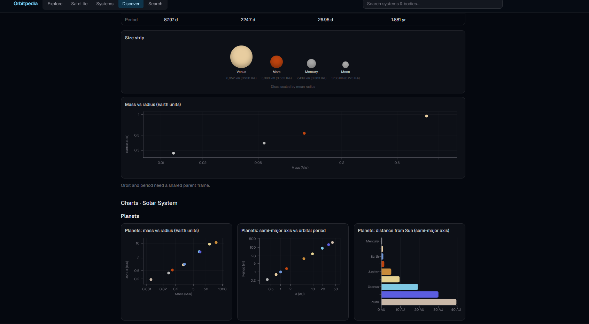
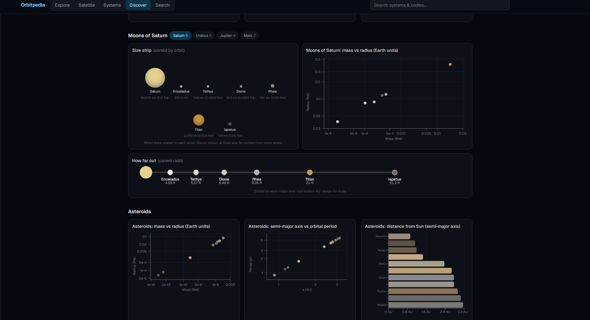

# Orbitpedia

Interactive atlas of the Solar System and known exoplanet hosts: 3D orbits, a Milky Way systems map, Earth satellites, probes, surface places, and comparison charts.

## Explore

One system at a time in 3D. Click a body to follow it, scrub simulation speed, and switch **Schematic**, **Proportional**, or **True** size. Home is the Solar System; other hosts open from Systems or Search.



Focus framing keeps the selected body readable. Facts on the right summarize mass, radius, orbit, and sources.



Surface places appear when you zoom in on a body. Jupiter’s Great Red Spot is one example: a callout on the globe with a short note and links.



Probes are selectable objects with mission facts and distance charts. Trajectories use archived path samples (for example Voyager 1).



## Satellite

A separate Earth-centered view for major LEO and polar missions (ISS, Hubble, weather and Earth-science satellites). Orbits come from Celestrak NORAD GP elements; Facts include owner, launch, and orbit regime when known.



## Systems

Browse roughly 4,700 catalog hosts on a Milky Way backdrop. **Schematic** spreads systems for readable wandering; **Proportional** uses sky distance. Filters, favorites, and click-to-Visit open Explore for that host.



## Discover

Compare bodies with size strips, mass–radius plots, and distance charts. Pick a system or Sol section and switch among planets, moons, and asteroids.





## Search

Typeahead from any page finds systems and bodies by name or alias.

## Sources

Facts panels link to the public pages used for each body.

| Domain | Primary sources |
|--------|-----------------|
| Solar System planets & moons | [JPL Horizons](https://ssd.jpl.nasa.gov/horizons/), [NASA Solar System Exploration](https://science.nasa.gov/solar-system/), SSD physical parameters |
| Asteroids & comets | [JPL Small-Body Database (SBDB)](https://ssd.jpl.nasa.gov/tools/sbdb_lookup.html) |
| Earth satellites | [Celestrak](https://celestrak.org/) NORAD GP elements |
| Exoplanet hosts (archive) | [NASA Exoplanet Archive](https://exoplanetarchive.ipac.caltech.edu/) (`pscomppars`) |
| Black-hole / special hosts | Curated cards with cited public references |

Values are labeled with provenance where known. Built for education and exploration, not precision ephemerides.

## Stack

- **Next.js** (App Router) + TypeScript + Tailwind
- **React Three Fiber** / drei / three.js for Explore and Satellite
- **Recharts** for Discover and probe distance charts
- **Zod**-validated catalog (system docs + per-body cards under `src/data/`)

## Run locally

```bash
npm install
npm run dev
```

Open [http://localhost:3000](http://localhost:3000).

```bash
npm run build && npm start   # production
npm test                     # orbit sanity + UI copy gates
```

### What ships in the repo

A fresh clone includes:

- The curated Solar System (planets, major moons, selected asteroids/comets, probes, Earth sats)
- A smoke pack of ~100 exoplanet systems (graphs under `public/archive/graphs/`)
- The full systems **index** (~4,766 hosts) for the Systems map

The full per-system Explore graphs for the entire archive live under `public/archive/bulk/` and are **not** in git (large). To Visit / Explore every archive host locally:

```bash
node scripts/ingest-exoplanet-archive.mjs --all --min-planets 1
```

See [docs/ARCHIVE_INGEST.md](docs/ARCHIVE_INGEST.md) and [docs/DATA_SETUP.md](docs/DATA_SETUP.md).
